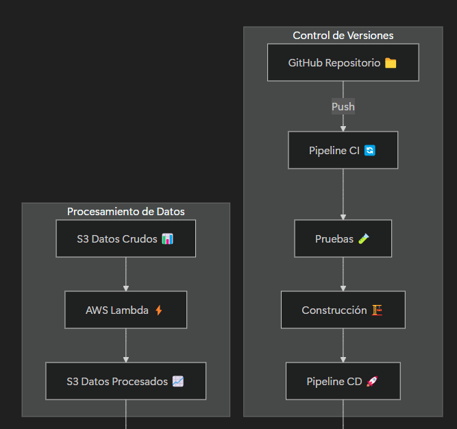
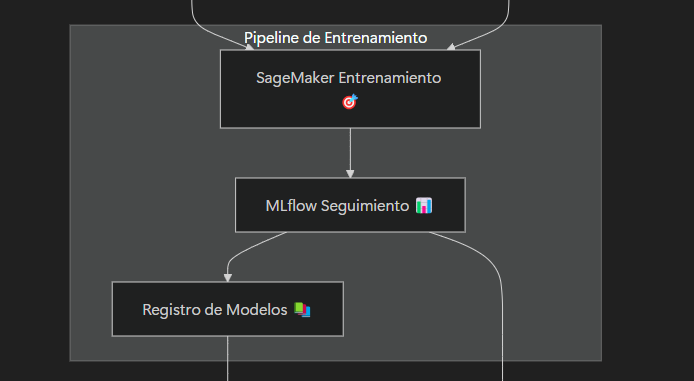
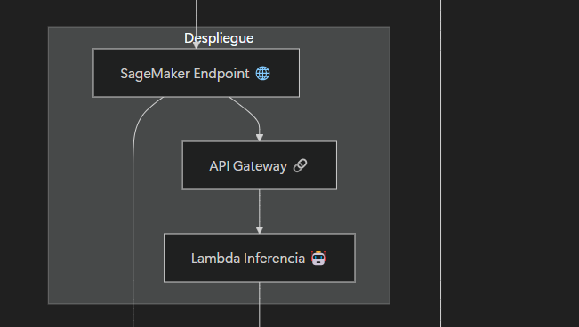
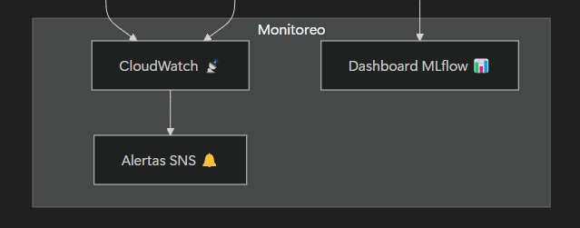

# 🚀 Proyecto MLOps - Machine Learning Engineer 

Este repositorio contiene la solución para la prueba técnica de **Machine Learning Engineer - GenAI**, diseñada para demostrar habilidades en **procesamiento de datos, modelado, despliegue y MLOps**.  

## 📂 Estructura de Directorios

Para garantizar una solución escalable y mantenible, se ha diseñado la siguiente estructura de directorios:

```plaintext
mlops_project/
│── data/                     # Almacenamiento de datos
│   ├── raw/                  # Datos sin procesar
│   ├── processed/            # Datos listos para entrenamiento
│   ├── external/             # Datos de terceros
│   └── interim/              # Datos en transformación
│
│── notebooks/                # Jupyter Notebooks para EDA y experimentación
│   ├── 01_exploracion.ipynb  
│   ├── 02_preprocesamiento.ipynb  
│   └── 03_entrenamiento.ipynb  
│
│── src/                      # Código fuente
│   ├── data/                 # Ingesta y preprocesamiento de datos
│   │   ├── ingestion.py       
│   │   ├── preprocessing.py   
│   │   ├── etl_pipeline.py   
│   │   └── data_loader.py    
│   │
│   ├── models/               # Modelos entrenados y scripts
│   │   ├── train.py          # Entrenamiento de modelos
│   │   ├── evaluate.py       # Evaluación del modelo
│   │   ├── predict.py        # Predicción en batch
│   │   ├── model_v1.pkl      # Modelo serializado versión 1
│   │   ├── model_v2.pkl      # Modelo serializado versión 2
│   │   └── tokenizer.pkl     # Tokenizador serializado
│   │
│   ├── deployment/           # Scripts para despliegue en AWS
│   │   ├── serve_model.py    
│   │   ├── aws_lambda.py    
│   │   ├── sagemaker_deploy.py  
│   │   └── requirements.txt  
│   │
│   ├── monitoring/           # Scripts para monitoreo y alertas
│   │   ├── model_monitor.py  
│   │   ├── drift_detection.py  
│   │   └── alert_system.py  
│   │
│   ├── utils/                # Funciones auxiliares
│   │   ├── helpers.py        
│   │   ├── logger.py         
│   │   └── config.py         
│
│── tests/                    # Pruebas unitarias y de integración
│   ├── test_preprocessing.py #ruebas para preprocesamiento
│   ├── test_training.py      #ruebas para entrenamiento del modelo
│   └── test_evaluation.py    #ruebas para evaluación del modelo
│   └── test_deployment.py    #ruebas para despliegue en SageMaker
│
│── configs/                  # Configuraciones del proyecto
│   ├── config.yaml           
│   ├── logging.yaml          
│   ├── model_params.yaml     
│   └── aws_config.json       
│
│── .github/                  # Configuración de CI/CD con GitHub Actions
│   ├── workflows/            
│   │   ├── ci.yml            
│   │   ├── cd.yml            
│   │   └── monitoring.yml    
│
│── README.md                 # Documentación del proyecto
│── requirements.txt           # Dependencias del proyecto
│── setup.py                   # Instalación del paquete
│── Dockerfile                 # Contenedor para despliegue
│── Makefile                   # Comandos automatizados
```

---

## 📌 **Explicación de la Estructura**
| **Directorio**  | **Descripción**  |
|----------------|---------------|
| `data/` | Contiene los datos en diferentes etapas del pipeline. |
| `notebooks/` | Jupyter notebooks para análisis exploratorio y experimentación. |
| `src/data/` | Código para ingesta y preprocesamiento de datos. |
| `src/models/` | Scripts de entrenamiento y evaluación, junto con modelos serializados. |
| `src/deployment/` | Scripts para desplegar en AWS (SageMaker, Lambda). |
| `src/monitoring/` | Scripts para monitoreo del modelo en producción. |
| `src/utils/` | Funciones auxiliares como logging y configuración. |
| `tests/` | Pruebas unitarias e integración. |
| `configs/` | Archivos de configuración YAML/JSON. |
| `.github/workflows/` | Pipelines de CI/CD en GitHub Actions. |
| `Dockerfile` | Configuración para despliegue en contenedores. |
| `Makefile` | Automatización de comandos. |

---

## 🔄 **Manejo de Versionado del Pipeline y Modelos**
Para garantizar la **reproducibilidad y trazabilidad**, seguimos estas estrategias:

### **1️⃣ Versionado del Pipeline de Preprocesamiento**
- Cada modificación en el pipeline de datos (`src/data/etl_pipeline.py`) se documenta con:
  - **Control de versiones en Git** (`etl_pipeline_v1.py`, `etl_pipeline_v2.py`, etc.).
  - **Etiquetas en Git** (`v1.0.0`, `v1.1.0`, etc.).
  - **Registro en MLflow** para seguimiento de cambios en preprocesamiento.

### **2️⃣ Versionado de Modelos Entrenados**
- Cada modelo serializado (`.pkl`) se almacena con su versión en `src/models/`:
  - `model_v1.pkl`, `model_v2.pkl`, etc.
- Se utiliza **MLflow y DVC (Data Version Control)** para:
  - Registrar métricas de cada versión.
  - Mantener historial de entrenamientos y mejoras.

### **3️⃣ Versionado de Configuraciones**
- Los hiperparámetros y configuración del modelo se almacenan en `configs/model_params.yaml`.
- Se mantiene control de cambios con Git y se etiquetan las versiones.

---

## 🚀 **Cómo Ejecutar el Proyecto**
### **1️⃣ Clonar el Repositorio**
```bash
git clone https://github.com/hecigsape/mlops_project
cd mlops_project
```

### **2️⃣ Instalar Dependencias**
```bash
pip install -r requirements.txt
```

### **3️⃣ Ejecutar el Pipeline**
```bash
python src/data/etl_pipeline.py
python src/models/train.py
python src/models/evaluate.py
```

### **4️⃣ Desplegar en AWS SageMaker**
```bash
python src/deployment/sagemaker_deploy.py
```

---

## 📊 **Monitoreo del Modelo**
- Se ejecuta con:
```bash
python src/monitoring/model_monitor.py
```
- Detecta **drift en los datos** y envía **alertas automáticas**.

---

## 🔐 **Seguridad Implementada**
- **Cifrado de datos** en AWS S3 (AES-256).
- **Roles IAM** con privilegios mínimos.
- **Auditoría y logs** en AWS CloudTrail.
- **Monitoreo de accesos** a la API del modelo.


---

## **📂 Diccionario de Datos** 📑  
📌 **Descripción de las columnas del dataset después del preprocesamiento.**  

| **Columna**          | **Descripción** |
|----------------------|----------------|
| `asin`              | Identificador único del producto en Amazon. |
| `helpful_vote`      | Número de votos indicando si la reseña fue útil. |
| `images`            | URLs de imágenes asociadas al producto. |
| `parent_asin`       | Identificador del producto principal (si pertenece a una familia de productos). |
| `rating`            | Calificación del usuario (1-5 estrellas). |
| `text`              | Texto completo de la reseña después de limpieza. |
| `timestamp`         | Fecha de la reseña en formato UNIX. |
| `title`             | Título de la reseña. |
| `user_id`           | ID del usuario que dejó la reseña. |
| `verified_purchase` | `True` si la compra fue verificada, `False` en caso contrario. |
| `language`          | Idioma detectado en la reseña (añadido durante el preprocesamiento). |

---

## **📌 Modelo de Datos Conceptual** 🎯  
📌 **Cómo se estructuran los datos después del preprocesamiento:**  
- **Entrada del modelo:** `text` (reseña), `title` (título), `verified_purchase`.  
- **Etiqueta (`y`) del modelo:** `rating` (1-5 estrellas).  
- **Campos eliminados:** `asin`, `images`, `parent_asin`, `timestamp`, `user_id`.  
- **Campos generados:** `language` (para filtrar datos por idioma).  

---

## **📌 Requerimientos de Hardware** 💻  
📌 **Para entrenar el modelo:**  
- **Mínimo:** 8GB RAM, 4 CPU.  
- **Recomendado:** 16GB RAM, GPU NVIDIA (para modelos más complejos como Transformers).  
- **Opcional:** TPU en Google Colab para acelerar entrenamiento.  

---

## **📌 Manejo del Desbalance de Clases** ⚖  
📌 **Estrategia aplicada para evitar sesgos en el modelo:**  
- **(Undersampling):** Se redujo la cantidad de reseñas con 5 estrellas para igualar las otras clases.  
  

---

## **📌 Evaluación del Modelo** 📊  
📌 **Métricas de evaluación:**  
- **Accuracy:** Para medir el desempeño general.  
- **F1-score:** Para evaluar rendimiento en clases desbalanceadas.  
- **Matriz de Confusión:** Para identificar errores comunes.  

📌 **Validación aplicada:**  
- **Hold-out (80%-20%)** para dividir entrenamiento y prueba.  
- **Cross-validation (k-fold)** para estabilidad del modelo.  


---
## 🔥 Arquitectura del Proyecto

Este repositorio implementa una arquitectura basada en **MLOps** utilizando AWS, GitHub Actions y SageMaker. A continuación, se muestra un diagrama del flujo completo.

**Descripción del Diagrama de Arquitectura MLOps:**

- 🔄 **Control de Versiones:** Integración con GitHub y pipelines de CI/CD automatizados
- 📊 **Procesamiento:** Datos almacenados en S3 y procesados con AWS Lambda
- 🎯 **Entrenamiento:** SageMaker gestiona el entrenamiento con seguimiento en MLflow
- 🌐 **Despliegue:** Endpoints de SageMaker expuestos vía API Gateway
- 📡 **Monitoreo:** Supervisión continua con CloudWatch y alertas SNS







